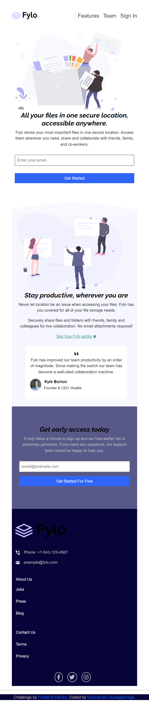

# Fylo-landing-page-with-two-column-layout-pro

This is a solution to the [Fylo landing page with two column layout challenge on Frontend Mentor](https://www.frontendmentor.io/challenges/fylo-landing-page-with-two-column-layout-5ca5ef041e82137ec91a50f5). Frontend Mentor challenges help you improve your coding skills by building realistic projects. 

## Table of contents

- [Overview](#overview)
  - [The challenge](#the-challenge)
  - [Screenshot](#screenshot)
  - [Links](#links)
- [My process](#my-process)
  - [Built with](#built-with)
  - [What I learned](#what-i-learned)
  - [Continued development](#continued-development)
  - [Useful resources](#useful-resources)
- [Author](#author)
- [Acknowledgments](#acknowledgments)

**Note: Delete this note and update the table of contents based on what sections you keep.**

## Overview

### The challenge

Users should be able to:

- View the optimal layout for the site depending on their device's screen size
- See hover states for all interactive elements on the page

### Screenshot

### Links

- Solution URL: [Add solution URL here](https://www.frontendmentor.io/challenges/fylo-landing-page-with-two-column-layout-5ca5ef041e82137ec91a50f5/hub/responsive-landing-page-using-bootstrap-and-css-flexbox-MPVGvW_XAD)
- Live Site URL: [Add live site URL here](https://fylo-landing-page-with-two-column-layout-olive.vercel.app/)

## My process

### Built with

- Semantic HTML5 markup
- CSS custom properties
- Flexbox
- CSS Grid
- Bootstrap 5
- javascript
### What I learned
I learnt majorly on how to use bootstap grid and how to use some javascript features

Use this section to recap over some of your major learnings while working through this project. Writing these out and providing code samples of areas you want to highlight is a great way to reinforce your own knowledge.

### Continued development
In the future, when i am done with javascript, i'll love to add some new developed  features into this same project
### Useful resources

- [Example resource 1](https://w3schools.com) - This helped in mastering my bootstrap skills. I really liked this pattern and will use it going forward.
## Author

- Website - [Add your name here](https://fylo-landing-page-with-two-column-layout-olive.vercel.app/)
- Frontend Mentor - [@yourusername](https://www.frontendmentor.io/profile/Gbangbolaoluwagbemiga)
- Twitter - [@yourusername](https://twitter.com/GbangbolaPhilip)

